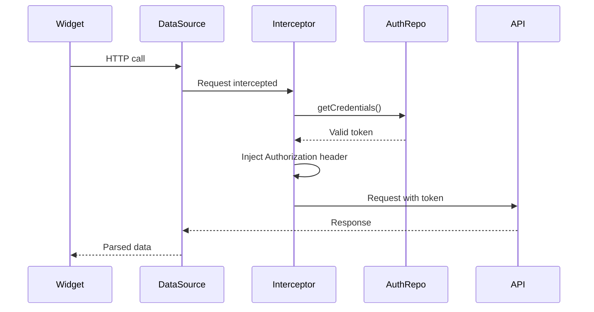

# Flutter Architecture - JsonPlaceholder App

## Executive Summary

This Flutter project follows a **modular clean architecture** that blends **Clean Architecture** principles with **Domain-Driven Design (DDD)**. It relies on **Riverpod** for dependency injection and reactive state management, **Go Router** for declarative navigation, and enforces a strict layering strategy inside every feature module.

## Project Structure

```
lib/
├── app/                    # Application bootstrap (global providers, initializers)
├── config/                 # Build-time environments and per-flavor parameters
├── core/                   # Shared code consumed by every feature
│   ├── data/               # Cross-cutting repositories, data sources, services
│   ├── domain/             # Common models, contracts, and reusable use cases
│   ├── presentation/       # Reusable widgets and screens (design system)
│   ├── extensions/         # Extensions over Flutter and Dart primitives
│   ├── styles/             # Global themes, typography, and color tokens
│   └── utils/              # Helpers, constants, formatters
├── features/               # Modular features (posts, comments, etc.)
├── l10n/                   # Generated localization resources
└── main.dart               # Application entry point
```

## Implemented Architectural Patterns

### 1. Clean Architecture
- **Separation of Concerns**: each layer owns a single responsibility.
- **Dependency Inversion**: outer layers depend on abstractions defined in the inner layers.
- **Independence**: business logic remains framework-agnostic and easy to test.

### 2. Modular Architecture
- **Isolated modules**: every feature ships with its own four-layer stack.
- **Reuse**: cross-cutting elements live in `/core` and can be shared safely.
- **Scalability**: straightforward to plug new modules into the system.

### 3. Repository Pattern
- **Data abstraction**: repositories expose interfaces to the domain layer.
- **Swapability**: switching from one data source to another happens behind the interface.
- **Testing**: repositories are easy to mock in unit tests.

### 4. Provider Pattern with Riverpod
- **Dependency Injection**: automatic graph creation through providers.
- **State Management**: reactive state modeled with `AsyncValue` and generated notifiers.
- **Code Generation**: `@riverpod` macros eliminate boilerplate controllers.

## Module Architecture

Every feature is organized into **four primary layers**:

```
features/[feature_name]/
├── data/                   # Data layer
│   ├── data_sources/       # Concrete data sources (API, storage, etc.)
│   │   ├── i_[feature]_data_source.dart     # Interface
│   │   └── [feature]_api_data_source.dart   # Implementation
│   └── repositories/       # Repository implementations
│       └── [feature]_repository.dart
├── domain/                 # Domain layer
│   ├── models/             # Domain entities/value objects
│   │   └── [feature]_model.dart
│   └── repositories/       # Contracts consumed by the application layer
│       └── i_[feature]_repository.dart
├── application/            # Application (use case) layer
│   └── use_cases/          # [feature]_use_case.dart / [action]_use_case.dart
└── presentation/           # Presentation layer
    ├── providers/          # Riverpod controllers
    │   ├── models/         # UI states and presentation models
    │   │   └── [feature]_state.dart
    │   └── [feature]_controller.dart
    ├── screens/            # Screens per feature
    │   └── [feature]_screen.dart
    └── widgets/            # Feature-specific widgets
        └── [feature]_widget.dart
```

### Layer Implementation Details

#### 1. Data Layer
**Responsibilities**
- Fetch data from APIs, local databases, or other services.
- Map external data structures to domain models.
- Provide the concrete implementation of repository contracts.

**Components**
- **Data Sources**: focus on a single transport (HTTP, local storage, etc.).
- **Repositories**: coordinate data sources and expose domain models.

```dart
// Data Source interface
abstract class IProfileDataSource {
  Future<Map<String, dynamic>> getMe();
}

// Data Source implementation
class ProfileApiDataSource implements IProfileDataSource {
  @override
  Future<Map<String, dynamic>> getMe() async {
    // Remote call logic
  }
}

// Repository implementation
class ProfileRepository implements IProfileRepository {
  final IProfileDataSource _dataSource;

  ProfileRepository({required IProfileDataSource dataSource}) 
      : _dataSource = dataSource;

  @override
  Future<QueryResponseModel<ProfileModel>> getMe() async {
    try {
      final response = await _dataSource.getMe();
      return QueryResponseModel(data: ProfileModel.fromJson(response));
    } catch (e) {
      return QueryResponseModel(message: e.toString(), isSuccessful: false);
    }
  }
}
```

#### 2. Domain Layer
**Responsibilities**
- Define business models and invariants.
- Declare repository interfaces (pure contracts).
- Keep business rules free from Flutter or infrastructure code.

**Components**
- **Models**: immutable domain objects with validation logic when needed.
- **Repository Interfaces**: abstractions required by use cases.

```dart
@freezed
class ProfileModel with _$ProfileModel {
  const factory ProfileModel({
    required String id,
    required String name,
    required String email,
    required List<TeamModel> teams,
  }) = _ProfileModel;

  factory ProfileModel.fromJson(Map<String, dynamic> json) => 
      _$ProfileModelFromJson(json);
}

abstract class IProfileRepository {
  Future<QueryResponseModel<ProfileModel>> getMe();
}
```

#### 3. Application Layer (Use Cases)
**Responsibilities**
- Orchestrate the collaboration between repositories and services before UI state changes.
- Expose composable, atomic operations to presentation controllers.
- Centralize validation that spans multiple repositories.

```dart
class FetchProfileUseCase {
  final IProfileRepository _repository;

  FetchProfileUseCase(this._repository);

  Future<QueryResponseModel<ProfileModel>> call() async {
    return _repository.getMe();
  }
}
```

#### 4. Presentation Layer
**Responsibilities**
- Manage UI state and side effects.
- Contain presentation-specific logic only.
- Interact with users through screens and widgets.

```dart
@freezed
class ProfileState with _$ProfileState {
  const factory ProfileState({
    ProfileModel? user,
    @Default('') String group,
    @Default(false) bool isLoading,
  }) = _ProfileState;

  factory ProfileState.init() => const ProfileState();
}

@riverpod
class ProfileController extends _$ProfileController {
  FetchProfileUseCase get _fetchProfileUseCase =>
      ref.read(fetchProfileUseCaseProvider);

  @override
  FutureOr<ProfileState> build() {
    ref.keepAlive();
    Future.microtask(onInit);
    return ProfileState.init();
  }

  Future<void> onInit() async {
    final response = await _fetchProfileUseCase();
    if (response.isSuccessful) {
      _setState(
        ProfileState(
          user: response.data!,
          group: (response.data!.teams.firstOrNull?.name ?? '')
              .replaceAll('/', ''),
        ),
      );
    }
  }

  void _setState(ProfileState newState) => state = AsyncValue.data(newState);
}
```

## Cross-Layer Data Flow

```
User → Widget → Controller → UseCase → Repository → DataSource → API/Storage
                                    ↓
User Interface ← Widget ← Controller ← UseCase ← Repository ← DataSource ← Response
```

### Step-by-Step Process

1. **Domain definition**
```dart
class UserModel { /* ... */ }

abstract class IUserRepository {
  Future<QueryResponseModel<UserModel>> getUser();
}
```

2. **Data layer implementation**
```dart
abstract class IUserDataSource {
  Future<Map<String, dynamic>> getUser();
}

class UserApiDataSource implements IUserDataSource { /* ... */ }

class UserRepository implements IUserRepository { /* ... */ }
```

3. **Application layer**
```dart
class GetUserProfileUseCase {
  final IUserRepository _repository;

  GetUserProfileUseCase(this._repository);

  Future<QueryResponseModel<UserModel>> call() {
    return _repository.getUser();
  }
}
```

4. **Presentation layer**
```dart
class UserState { /* ... */ }

class UserController extends _$UserController {
  final GetUserProfileUseCase _getUserProfile;

  UserController(this._getUserProfile);

  Future<void> loadUser() async {
    final response = await _getUserProfile();
    // Handle result
  }
}

class UserScreen extends ConsumerWidget { /* ... */ }
```

5. **Dependency injection**
```dart
final userDataSourceProvider = Provider<IUserDataSource>((ref) => UserApiDataSource());

final userRepositoryProvider = Provider<IUserRepository>((ref) =>
    UserRepository(dataSource: ref.read(userDataSourceProvider)));

final getUserProfileUseCaseProvider = Provider<GetUserProfileUseCase>((ref) =>
    GetUserProfileUseCase(ref.read(userRepositoryProvider)));
```

### Request and Response Flow

#### Request (User → API)
1. A widget notifies its controller.
2. The controller calls a use case.
3. The use case talks to the repository (contract from domain).
4. The repository forwards to the data source.
5. The data source performs the HTTP/local operation.

#### Response (API → User)
1. The data source returns the raw payload.
2. The repository converts it into a domain model and wraps it with `QueryResponseModel`.
3. The use case applies any additional rules and returns it.
4. The controller updates the immutable state.
5. UI widgets rebuild automatically (Consumer/ConsumerWidget).

### Data Flow Principles

- **Unidirectional data flow** keeps state predictable—data only moves from the source to the UI and never backwards.
- **Centralized error handling** bubbles problems through repositories and use cases before the UI reacts.
- **State management** relies on `AsyncValue`, immutable `@freezed` states, and Riverpod reactivity.

#### Error Handling Example

```dart
// Repository
try {
  final data = await _dataSource.getData();
  return QueryResponseModel(data: Model.fromJson(data));
} catch (e) {
  return QueryResponseModel(message: e.toString(), isSuccessful: false);
}

// Use case
class GetDataUseCase {
  final IRepository _repository;

  GetDataUseCase(this._repository);

  Future<QueryResponseModel<Model>> call() async {
    final response = await _repository.getData();
    // Additional checks can happen here
    return response;
  }
}

// Controller
final response = await _getDataUseCase();
if (response.isSuccessful) {
  _setState(newState);
} else {
  UIKitToast.show(message: response.message, type: ToastType.error);
}
```

## Navigation with Go Router

The project uses **Go Router** for declarative navigation, deep linking, and programmatic control.

### Route Enum

```dart
enum Routes {
  splash(routeName: 'splash', path: '/splash'),
  home(routeName: 'home', path: '/', title: 'Home');
  // ... more routes

  const Routes({
    required this.routeName,
    required this.path,
    this.title = '',
  });

  final String routeName;
  final String path;
  final String title;

  static List<Routes> get homeRoutes => [home];
  static List<Routes> get unauthenticatedRoutes => [splash];
}
```

### GoRouter Provider

```dart
final goRouterProvider = Provider<GoRouter>((ref) {
  return GoRouter(
    navigatorKey: Constants.navigatorKey,
    initialLocation: Routes.home.path,
    errorBuilder: (context, state) => const NotFoundScreen(),
    redirect: (context, state) async {
      final authState = ref.read(authenticationControllerProvider).value!;

      if (authState.isVerifying && !authState.isAuthenticated &&
          state.uri.path != Routes.welcome.path) {
        return Routes.splash.path;
      }

      final isProtected = !Routes.unauthenticatedRoutes
          .any((route) => route.path == state.uri.path);

      if (!authState.isAuthenticated && isProtected) {
        return authState.isVerifying ? Routes.welcome.path : Routes.login.path;
      }

      return null;
    },
    routes: [
      ShellRoute(
        builder: (context, state, child) =>
            MenuNavigation(child: child, canPop: false),
        routes: [
          GoRoute(
            name: Routes.home.routeName,
            path: Routes.home.path,
            builder: (context, state) => const HomeScreen(),
          ),
          // ... shell routes
        ],
      ),
    ],
  );
});
```

### Navigation Usage

```dart
context.goNamed(Routes.home.routeName);     // by name
context.go(Routes.home.path);               // by path
context.pushNamed(Routes.home.routeName);   // push keeps previous entry
context.push(Routes.home.path);

context.goNamed(
  Routes.transactionDetail.routeName,
  pathParameters: {'id': '12345'},
);
```

### Global Navigation Helpers

```dart
Constants.navigatorKey.currentContext!.go(Routes.home.path);

class AuthenticationController extends _$AuthenticationController {
  Future<void> onLogin(String email, String password) async {
    final authResponse = await _authRepository.login(email, password);
    if (authResponse.isSuccessful) {
      Constants.navigatorKey.currentContext!.go(Routes.home.path);
    }
  }

  Future<void> onLogout() async {
    await _authRepository.logout();
    Constants.navigatorKey.currentContext!.go(Routes.login.path);
  }
}
```

### BuildContext Extensions

```dart
extension CustomBuildContextExtension on BuildContext {
  Routes get currentRoute {
    final String location = GoRouterState.of(this).matchedLocation;
    return Routes.values.firstWhere((route) => route.path == location);
  }
}
```

### Benefits of Go Router

1. **Type safety** through strongly typed enum routes.
2. **Deep linking** out of the box.
3. **Route protection** using redirect guards.
4. **Declarative APIs** that mirror Widget building.
5. **Shell routes** for shared layouts and nested navigation.
6. **Tight Riverpod integration** for reactive redirects.
7. **Centralized error handling** for missing routes.
8. **Custom transitions** per route when needed.

## Key Technologies and Tooling

### HTTP Client with Dio and Interceptors

The stack uses **Dio** as the HTTP client along with interceptors that automatically inject authentication headers, centralize error handling, and support future refresh-token logic.

#### `DioHttpClientService`

```dart
class DioHttpClientService {
  DioHttpClientService({required this.authRepository}) {
    _addInterceptor();
  }

  final IAuthRepository authRepository;

  Dio get client => _dio;

  static final _dio = Dio(
    BaseOptions(
      baseUrl: ApiPathConstants.host,
      connectTimeout: const Duration(milliseconds: 10000),
      sendTimeout: const Duration(milliseconds: 30000),
      receiveTimeout: const Duration(milliseconds: 60000),
    ),
  );

  void _addInterceptor() {
    _dio.interceptors.add(
      InterceptorsWrapper(
        onRequest: (options, handler) async {
          final token = await authRepository.getCredentials();

          if (token.isSuccessful == false) {
            return handler.reject(
              DioException(
                requestOptions: options,
                error: Constants.localization.invalidCredentialsMessage,
              ),
            );
          }

          options.headers['Authorization'] =
              'Bearer ${token.data?.accessToken}';

          return handler.next(options);
        },
      ),
    );
  }
}

final dioHttpClientService = Provider<DioHttpClientService>((ref) {
  return DioHttpClientService(
    authRepository: ref.read(authRepositoryProvider),
  );
});
```

#### API Path Constants

```dart
class ApiPathConstants {
  static final host = Environment().config.apiHost;

  static String posts = 'posts/';
  static String getMe = 'profile/me';
}
```

#### Data Source Usage

```dart
class ProfileApiDataSource implements IProfileDataSource {
  final Dio _client;

  ProfileApiDataSource({required DioHttpClientService client})
      : _client = client.client;

  @override
  Future<Map<String, dynamic>> getMe() async {
    try {
      final response = await _client.get(ApiPathConstants.getMe);
      return response.data;
    } on DioException catch (e) {
      throw ApiErrorModel.fromDioException(e);
    } catch (e) {
      throw Exception(Constants.localization.genericErrorMessage);
    }
  }
}

final profileApiDataSourceProvider = Provider<IProfileDataSource>((ref) {
  return ProfileApiDataSource(client: ref.read(dioHttpClientService));
});
```

```dart
class PostDataSource extends IAuthDataSource {
  final _client = Dio(BaseOptions(baseUrl: Constants.postUrl));

  @override
  Future<Map<String, dynamic>> get(int id) async {
    try {
      final response = await _client.get(
        ApiPathConstants.posts.replaceAll('{id}', id.toString()),
      );
      return response.data;
    } on DioException catch (e) {
      throw ApiErrorModel.fromDioException(e);
    }
  }
}
```

#### Centralized HTTP Error Handling

```dart
class ApiErrorModel {
  final String message;
  final int? statusCode;
  final String? errorCode;

  ApiErrorModel({
    required this.message,
    this.statusCode,
    this.errorCode,
  });

  factory ApiErrorModel.fromDioException(DioException e) {
    switch (e.type) {
      case DioExceptionType.connectionTimeout:
        return ApiErrorModel(
          message: 'Connection timeout',
          statusCode: e.response?.statusCode,
        );
      case DioExceptionType.sendTimeout:
        return ApiErrorModel(
          message: 'Request timeout',
          statusCode: e.response?.statusCode,
        );
      case DioExceptionType.receiveTimeout:
        return ApiErrorModel(
          message: 'Response timeout',
          statusCode: e.response?.statusCode,
        );
      case DioExceptionType.badResponse:
        return ApiErrorModel(
          message: e.response?.data['message'] ?? 'Bad response',
          statusCode: e.response?.statusCode,
          errorCode: e.response?.data['error_code'],
        );
      default:
        return ApiErrorModel(
          message: 'Network error',
          statusCode: e.response?.statusCode,
        );
    }
  }
}
```

#### Interceptor Flow



#### Interceptor Advantages

1. **Automatic token injection** keeps data sources clean.
2. **Header centralization**: shared headers live in one place.
3. **Unified error handling** via `ApiErrorModel`.
4. **Future refresh tokens** can be implemented inside the interceptor.
5. **Logging & debugging**: add `LogInterceptor` during development.

#### Advanced Interceptors

```dart
if (kDebugMode) {
  _dio.interceptors.add(
    LogInterceptor(
      requestBody: true,
      responseBody: true,
      requestHeader: true,
      responseHeader: false,
    ),
  );
}

_dio.interceptors.add(
  InterceptorsWrapper(
    onError: (e, handler) async {
      if (e.response?.statusCode == 401) {
        final newToken = await authRepository.refreshToken();
        if (newToken.isSuccessful) {
          final options = e.requestOptions;
          options.headers['Authorization'] =
              'Bearer ${newToken.data?.accessToken}';
          final response = await _dio.request(
            options.path,
            options: Options(
              method: options.method,
              headers: options.headers,
            ),
            data: options.data,
            queryParameters: options.queryParameters,
          );
          return handler.resolve(response);
        }
      }
      return handler.next(e);
    },
  ),
);
```

#### Endpoint Strategy

1. **Authenticated endpoints** use the shared `dioHttpClientService` (profile, cards, transactions, etc.).
2. **Authentication endpoints** (login, refresh, reset password) use a plain Dio client without auth interceptors.
3. **Public endpoints** (e.g., Google Places) can provide bespoke clients per service.

### Dependencies

- **Core**: `flutter_riverpod`, `go_router`, `freezed`, `dio`.
- **Dev tooling**: `riverpod_generator`, `build_runner`, `flutter_localizations`.
- **UI/UX**: `toastification`, `image_picker`.

## Architectural Benefits

### Maintainability
- Clear separation of concerns.
- Modular structure that makes defects easy to locate and fix.

### Testability
- Interfaces simplify mocking.
- Business logic is isolated from Flutter specifics.
- Dependency injection wires everything together deterministically.

### Scalability
- New modules follow the same folder template.
- Core components are reusable.

### Flexibility
- Swap implementations without touching consumers.
- Support multiple data sources per repository.

## UI Kit / Design System

A cohesive design system is implemented under `/core/presentation/`, concentrating reusable components, tokens, and behaviors.

## Internationalization (i18n)

### Structure

```
l10n/
├── app_localizations.dart           # Generated base class
├── app_localizations_en.dart        # English implementation
└── app_en.arb                       # English resources
```

### Pubspec Configuration

```yaml
dependencies:
  flutter_localizations:
    sdk: flutter
  intl: any

flutter:
  generate: true
```

### Usage

```dart
Text(context.localization.welcome);
Text(context.localization.email);
Text(context.localization.login);

AppLocalizations.of(context)!.welcome;
```

### String Organization

```json
{
  "@GENERAL": {},
  "welcome": "Welcome",
  "email": "Email",
  "password": "Password"
}
```

### Adding Languages

1. Create `app_[locale].arb`.
2. Append the locale to `supportedLocales`.
3. Run `flutter gen-l10n`.

## Environment Configuration

### Folder Layout

```
config/
├── environment.dart          # Environment enum
├── base_config.dart          # Base interface
├── dev_config.dart           # Development config
└── prod_config.dart          # Production config
```

### Implementation

```dart
enum EnvironmentType {
  dev('dev', 'development'),
  prod('prod', 'production');

  const EnvironmentType(this.value, this.label);

  final String value;
  final String label;

  BaseConfig getConfig() {
    return this == EnvironmentType.prod ? ProdConfig() : DevConfig();
  }
}

abstract class BaseConfig {
  String get postUrl;
  String get apiHost;
  // Additional settings
}
```

### main.dart Setup

```dart
void main() {
  const environment = String.fromEnvironment('app.flavor');
  Environment().initConfig(EnvironmentType.fromString(environment));
  runApp(const App());
}
```

### Global Constants

```dart
class Constants {
  static String postUrl = Environment().config.postUrl;
  static String apiHost = Environment().config.apiHost;

  static const double radius = 10;
  static const int toastDuration = 7;
  static final navigatorKey = GlobalKey<NavigatorState>();
}
```

### Running with Flavors

```bash
flutter run --dart-define=app.flavor=dev
flutter run --dart-define=app.flavor=prod
```

## Extensions

### BuildContext Extension

```dart
extension CustomBuildContextExtension on BuildContext {
  TextTheme get textTheme => Theme.of(this).textTheme;
  double get height => MediaQuery.of(this).size.height;
  double get halfWidth => MediaQuery.of(this).size.width * 0.5;
  AppLocalizations get localization => AppLocalizations.of(this)!;
  Routes get currentRoute => // Implementation omitted
}
```

### Double Extension

```dart
extension CustomDoubleExtension on double {
  Widget get heightWidget => SizedBox(height: this);
  Widget get widthWidget => SizedBox(width: this);
  String get formattedCurrency =>
      '\$${NumberFormat.currency(locale: 'en', symbol: '', decimalDigits: 0).format(this)}';
}
```

### Sample Usage

```dart
class MyWidget extends StatelessWidget {
  @override
  Widget build(BuildContext context) {
    return Column(
      children: [
        Text(context.localization.welcome),
        16.0.heightWidget,
        SizedBox(
          width: context.halfWidth,
          child: Text(
            1250.0.formattedCurrency,
            style: context.textTheme.bodyLarge,
          ),
        ),
      ],
    );
  }
}
```

## Utilities

### Text Validators

```dart
class TextValidator {
  static final RegExp emailRegExp =
      RegExp(r'^[\w\-\.\+]+@([\w-]+\.)+[\w-]{2,4}$');

  static bool isValidEmail(String email) => emailRegExp.hasMatch(email);

  static String? validateEmail(String? email, BuildContext context) {
    if (email == null || !isValidEmail(email)) {
      return context.localization.invalidEmail;
    }
    return null;
  }
}
```

### Image Constants

```dart
class ImagesConstants {
  static const String home = 'assets/icons/home.svg';
  static const String homeOutline = 'assets/icons/home-outline.svg';
  static const String userCircle = 'assets/icons/user-circle.svg';
  // ... more icons
}
```

## Styles, Typography, and Colors

### Color Scheme

```dart
class CustomColorScheme {
  static const Color primary100 = Color(0xFF003E31);
  static const Color primary90 = Color(0xFF12715D);
  static const Color primary80 = Color(0xFF35A48D);
  static const Color gray90 = Color(0xFF1A1A1A);
  static const Color gray50 = Color(0xFF9E9E9E);
  static const Color white = Color(0xFFFFFFFF);
}
```

### Typography

```dart
class CustomTextTheme {
  static const TextStyle _baseTextStyle = TextStyle(
    color: CustomColorScheme.gray90,
    fontFamily: 'PathwayExtreme',
    fontWeight: FontWeight.w500,
    fontSize: 16.0,
  );

  static TextStyle small = _baseTextStyle.copyWith(fontSize: 12.0);
  static TextStyle body = _baseTextStyle.copyWith(fontSize: 16.0);
  static TextStyle h1 = _baseTextStyle.copyWith(fontSize: 60.0);
}
```

### Theme Extensions

```dart
extension CustomTextThemeExtension on TextTheme {
  TextStyle get small => CustomTextTheme.small;
  TextStyle get body => CustomTextTheme.body;
  TextStyle get h1 => CustomTextTheme.h1;
}

extension CustomColorSchemeExtension on ColorScheme {
  Color get primary100 => CustomColorScheme.primary100;
  Color get gray50 => CustomColorScheme.gray50;
}
```

### Global Theme Setup

```dart
class MyThemes {
  static ThemeData lightTheme = ThemeData(
    colorScheme: lightColorScheme,
    textTheme: const TextTheme().apply(
      bodyColor: CustomColorScheme.gray90,
      displayColor: CustomColorScheme.gray90,
      fontFamily: 'PathwayExtreme',
    ),
    // Additional configuration
  );
}
```

### Styled Component Example

```dart
class StyledWidget extends StatelessWidget {
  @override
  Widget build(BuildContext context) {
    return Container(
      decoration: BoxDecoration(
        color: CustomColorScheme.primary100,
        borderRadius: BorderRadius.circular(Constants.radius),
      ),
      child: Text(
        'Styled text',
        style: context.textTheme.body!.copyWith(
          color: CustomColorScheme.white,
        ),
      ),
    );
  }
}
```

### Style System Benefits

1. **Visual consistency** because every component consumes the same tokens.
2. **Maintainability** thanks to centralized values.
3. **Scalability** when adding new colors or typographic scales.
4. **Accessibility** with predefined contrasts.
5. **Dark mode ready** because tokens are abstracted from widgets.

## Best Practices

1. **Naming conventions**: descriptive, consistent names.
2. **Error handling**: centralized through models and interceptors.
3. **Code generation** to avoid boilerplate.
4. **Immutability** across states and models.
5. **Dependency inversion** through interfaces.
6. **Single responsibility** per class.
7. **Design system** for reusable UI components.
8. **Internationalization** with generated localizations.
9. **Environment configuration** via per-flavor builds.
10. **Extensions** to elevate developer experience.
